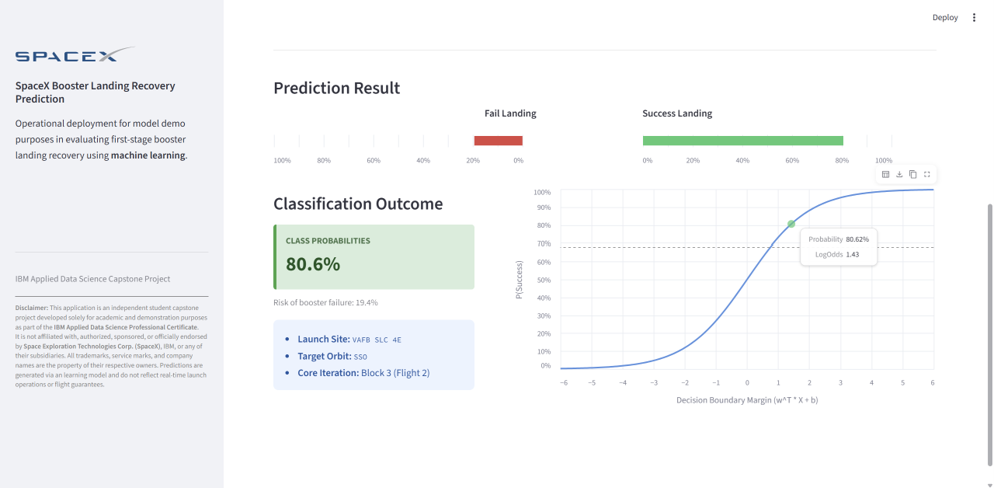

# 🚀 SpaceX Falcon 9 Booster Landing Recovery Prediction

Classification Machine Learning Model to Determine First Stage Booster Success Landing from SpaceX Falcon 9 Launch Dataset


<div style="
        font-size: 11px; 
        color: #888888; 
        line-height: 1.4; 
        border-top: 1px solid #333333; 
        padding-top: 10px; 
        margin-top: 1px;">
        <strong>Disclaimer:</strong> This application is an independent student capstone 
        project developed solely for academic and demonstration purposes as part of 
        <a href="https://www.coursera.org/learn/applied-data-science-capstone?specialization=ibm-data-science" style="color: #4A90E2; text-decoration: underline;">IBM Applied Data Science Capstone Course</a>.
        It is not affiliated with, authorized, sponsored, or officially endorsed by 
        <strong>Space Exploration Technologies Corp. (SpaceX)</strong>, IBM, or any of 
        their subsidiaries. All trademarks, service marks, and company names are the 
        property of their respective owners. Predictions are generated via an 
        learning model and do not reflect real-time launch operations or flight guarantees.
    </div>

## Setup Environment - Python Built-in venv
```
# Open Terminal in the project directory
python -m venv myenv
```

## Activate Environment
```
# Windows
myenv\Scripts\activate

# macOS / Linux
source myenv/bin/activate
```

## Install Required Libraries
```
pip install -r requirements.txt
```

## Run Local streamlit app
```
streamlit run main.py
```

## Streamlit Deployed App (Demo Purposes)
[Click here to open streamlit deployed app](https://ibm-capstone-spacex-landing-prediction.streamlit.app/)

[](https://ibm-capstone-spacex-landing-prediction.streamlit.app/)
